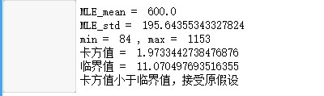
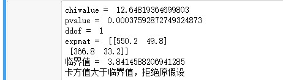

<style>
table {
margin: auto;
}
</style>

<script type="text/javascript" src="http://cdn.mathjax.org/mathjax/latest/MathJax.js?config=TeX-AMS-MML_HTMLorMML"></script>
<script type="text/x-mathjax-config">
    MathJax.Hub.Config({ tex2jax: {inlineMath: [['$', '$']]}, messageStyle: "none" });
</script>

# <div align = "center">数理统计——假设检验</div>

## <div align = "center">ZY2006109_姬轶</div>

### $P40^{25}$ 解：
> &emsp;&emsp;检验分布假设：$H_0：X \sim N(\mu, \sigma^2)$，其中$\mu$和$\sigma^2$是未知参数，极大似然估计为$\hat{\mu}=\bar{x}=600, \hat{\sigma^2}=\frac{1}{n}\sum\limits_{i=1}^{n}(x_i-\bar{x})^2=38276.4$。
> 
> &emsp;&emsp;将数据按$(-\infin, 300]$, $(300, 400]$, $(400, 500]$, $(500, 600]$, $(600, 700]$, $(700, 800]$, $(800, 900]$, $(900, +\infin)$分为八组，检验统计量$\chi^2 = \sum\limits_{i=1}^{8}\frac{(f_k-n\hat{p_k})^2}{n\hat{p_k}}$，$\chi^2$分布的自由度为$8-2-1=5$，拒绝域为$W=\{\chi^2 \geq \chi_{1-\alpha}^2(5)\}$，通过计算可得$\chi^2=1.974$，查询表格可得，$\chi_{1-0.05}^2(5)=11.070$，故接受假设，刀具寿命服从正态分布。
> 
> &emsp;&emsp;通过程序进行验证：
> ```python
> # 极大似然估计 得到均值与标准差
> x_mean, x_std = norm.fit(data)
> print('MLE_mean = ', x_mean)
> print('MLE_std = ', x_std)
> 
> # 检查数据最小值与最大值
> print("min = ", min(data), ", max = ", max(data))
> 
> # 对数据进行分组，以600为中心向两侧，共分8组
> listBins = [-10000000, 300, 400, 500, 600, 700, 800, 900, 1000000]
> cutted = pd.cut(data, bins=listBins, labels=False)
> 
> #遍历cutted，得到实际频数
> fk = np.zeros(8)
> for i in cutted:
>     fk[i] += 1
> 
> #计算理论频数
> npk = np.zeros(8)
> for i, j in enumerate(listBins[:-1]):
>    npk[i] = len(data)*(norm.cdf(listBins[i + 1], loc=x_mean, scale=x_std) - norm.cdf(listBins[i], loc=x_mean, scale=x_std))
> ```
> 
> ```python
> # 调库进行卡方拟合，得到卡方值
> chivalue = chisquare(f_obs = fk, f_exp = npk, ddof = 5).statistic
> print("卡方值 = ", chivalue)
> 
> #查表得到拒绝域临界值，比较后得到结论
> critical = chi2.isf(0.05, 5)
> ```
> &emsp;&emsp;程序运行结果如下：
> 
> <div align=center></div>

</br>
</br>

### $P40^{25}$ 解：
> |  | 正常 | 色盲 | $\sum$ |
> |:---:|:---:|:---:|:---:|
> | 男 | 535 | 65 | 600 |
> | 女 | 382 | 18 | 400 |
> | $\sum$ | 917 | 83 | 1000 |
> &emsp;&emsp;需要假设检验：
> $$H_0:p_{ij}=p_{i·}p_{·j}; \qquad i=1,2,\qquad j=1,2$$
> &emsp;&emsp;检验统计量为：
> $$\chi^2=\sum\limits_{i=1}^{2}\sum\limits_{j=1}^{2}\frac{(n_{ij}-\frac{n_{i·}n_{·j}}{n})^2}{\frac{n_{i·}n_{·j}}{n}}$$
> &emsp;&emsp;拒绝域为$W=\{\chi^2\geq \chi_{1-\alpha}^2((r-1)(s-1))\}$，其中自由度为$(r-1)(s-1)=1$，将数据带入计算可得：$\chi^2=12.648$。查询表格可得，$\chi_{1-0.05}^2(1)=3.841$，故拒绝假设。
> &emsp;&emsp;通过程序进行验证：
> ```python
> # 输入数据
> obs = np.array([[535, 65], [382, 18]])
> 
> # 调库进行卡方检验
> chivalue, pvalue, ddof, expmat = chi2_contingency(obs, correction=False)
> 
> #依次打印卡方值、p值、自由度、期望矩阵
> print("chivalue = ", chivalue, "\npvalue = ", pvalue, "\nddof = ", ddof, > "\nexpmat = ", expmat)
> 
> #查表得到拒绝域临界值，比较后得到结论
> critical = chi2.isf(0.05, ddof)
> ```
> &emsp;&emsp;程序运行结果如下：
> 
> <div align=center></div>