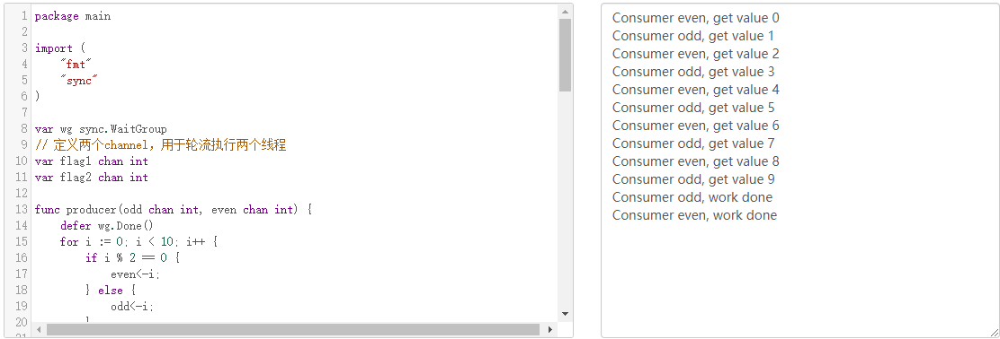

# <center>Lec07作业</center>

## <center>ZY2006109-姬轶</center>

</br>

### 生产者、消费者问题（Go语言）
&emsp;&emsp;假设存在一个生产者，依次产生数字0到9。存在一个奇数消费者，一个偶数消费者分别使用奇数和偶数，使用Go语言通道实现这个生产者消费者模型。

&emsp;&emsp;更改程序使得数字按从小到大的顺序输出。

> 解：
> &ensp;利用通道在消费者之间建立协议，具体规则如下：
> 
> &emsp;&emsp;&emsp;定义两个channel，flag1与flag2，分别对应奇数消费者与偶数消费者，channel缓冲区大小为1，若缓冲区为0，可放入标识，若继续取出标识则会阻塞；若缓冲区为1，可取出标识，若继续放入标识则会阻塞。
> 
> &emsp;&emsp;&emsp;初始对flag2（偶数消费者）添加标识，标识从0开始。
> 
> &emsp;&emsp;&emsp;此时oddConsumer()无法从flag1中取出标识，故阻塞，evenConsumer()从flag2中取出标识，并打印结果，而后向flag1中放入标识，oddConsumer()不再阻塞，并以此类推。
> 
> &emsp;&emsp;&emsp;程序更改处皆有注释，能够更明显的看到程序的修改逻辑，程序如下：
> ```go
> package main
> 
> import (
> 	"fmt"
> 	"sync"
> )
> 
> var wg sync.WaitGroup
> // 定义两个channel，用于轮流执行两个线程，缓冲区大小为1
> var flag1 chan int
> var flag2 chan int
> ```
> 
> ```go
> func producer(odd chan int, even chan int) {
> 	defer wg.Done()
> 	for i := 0; i < 10; i++ {
> 		if i % 2 == 0 {
> 			even<-i;
> 		} else {
> 			odd<-i;
> 		}
> 	}
> 	close(odd)
> 	close(even)
> }
> 
> 
> func oddConsumer(odd chan int) {
> 	defer wg.Done()
> 	for {
> 		value, ok := <-odd
> 		if !ok {
> 			// 到达终止条件，更改channel标识，输出work done
> 			flag2 <- 1
> 			<-flag1
> 			fmt.Printf("Consumer odd, work done\n")
> 			return
> 		}
> 		// 更改奇偶缓冲区状态，从channel flag1中取出标识，向channel flag2中放入标识
> 		<- flag1
> 		fmt.Printf("Consumer odd, get value %d\n", value)
> 		flag2 <- 1
> 	}
> }
> 
> func evenConsumer(even chan int) {
> 	defer wg.Done()
> 	for {
> 		value, ok := <- even
> 		if !ok {
> 			// 到达终止条件，更改channel标识，输出work done
> 			flag1 <- 1
> 			<- flag2
> 			fmt.Printf("Consumer even, work done\n")
> 			return
> 		}
> 		// 更改奇偶缓冲区状态，从channel flag2中取出标识，向channel flag1中放入标识
> 		<- flag2
> 		fmt.Printf("Consumer even, get value %d\n", value)
> 		flag1 <- 1
> 	}
> }
> 
> func main() {
> 	oddChannel := make(chan int)
> 	evenChannel := make(chan int)
> 
> 	// 初始化channel，并向channel flag2中放入标识，表示偶数消费者先执行
> 	flag1 = make(chan int, 1)
> 	flag2 = make(chan int, 1)
> 	flag2 <- 1
> 
> 	wg.Add(3)
> 	go producer(oddChannel, evenChannel)
> 	go oddConsumer(oddChannel)
> 	go evenConsumer(evenChannel)
> 
> 	wg.Wait()
> }
> ```

### 程序运行结果如下所示

<div align=center></div>