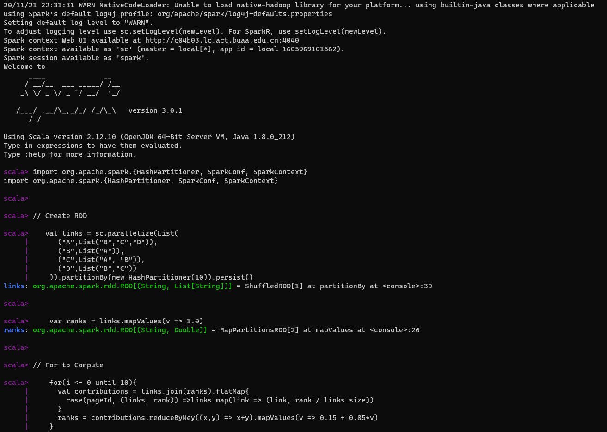
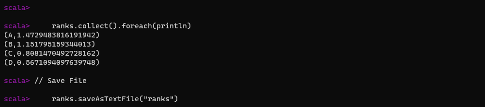
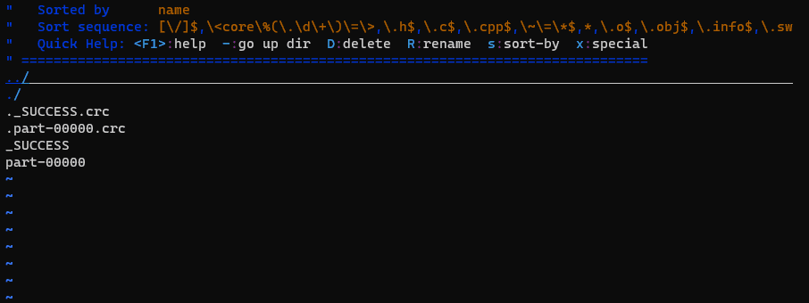
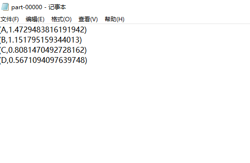

# <center>PageRank作业</center>

## <center>ZY2006109-姬轶</center>

### 一、Scala代码的简要说明讲解

```Scala
//  Create RDD（构造RDD函数）
val links = sc.parallelize(List(
    ("A",List("B","C","D")),
    ("B",List("A")),
    ("C",List("A", "B")),
    ("D",List("B","C"))
)).partitionBy(new HashPartitioner(10)).persist()

//  每个页面的排序值初始化为 1.0
var ranks = links.mapValues(v => 1.0)

//  For to Compute（十次循环计算更新ranks）
for(i <- 0 until 10){
    val contributions = links.join(ranks).flatMap{
        case(pageId, (links, rank)) =>links.map(link => (link, rank / links.size))
    }

//  每个页面的排序值设为 0.15 + 0.85 * contributionsReceived
    ranks = contributions.reduceByKey((x,y) => x+y).mapValues(v => 0.15 + 0.85*v)
}

//  输出跑出的结果
ranks.collect().foreach(println)

//  Save File（保存文件到"ranks"中）
ranks.saveAsTextFlie("ranks")
```

### 二、Spark运行的截图

<div style="align: center"></div>

<div style="align: center"></div>

### 三、ranks文件的截图

<div style="align: center"></div>

<div style="align: center"></div>
