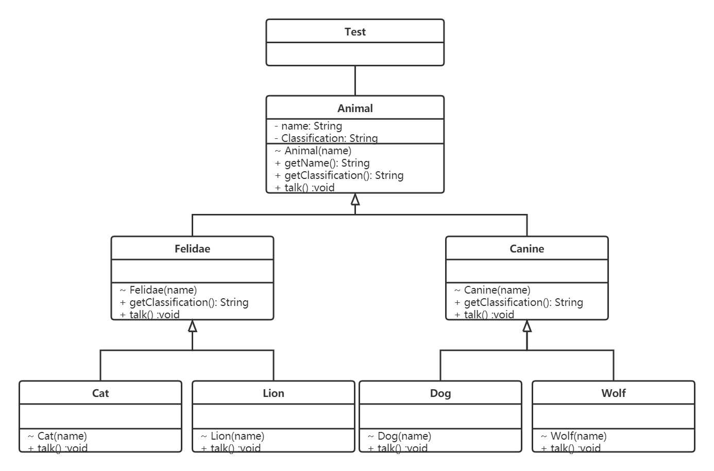
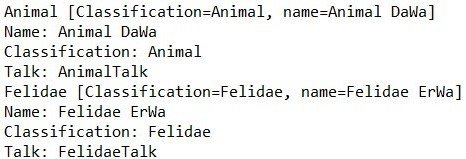
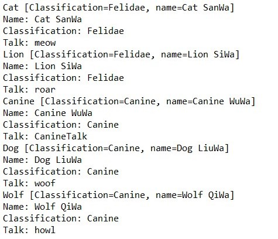

# <center>多态</center>

## <center>ZY2006109-姬轶</center>

### 一、类图：说明类，以及类与类之间的继承关系

<div style="align: center"></div>

### 二、程序运行结果

使用数组存放Animal、Felidae、Canine、Cat、Lion、Dog、Wolf七个对象。

使用for循环，调用`getName()`、`getClassification()`和`talk()`方法进行输出。

<div style="align: center"></div>

<div style="align: center"></div>

### 三、所有的代码实现

```java
public class Test {
    //Animal类
	public static class Animal {
		private String name;
		private String Classification;
		
		public Animal(String name) {
			this.name = name;
			this.Classification = "Animal";
		}
		public String getName() {
			System.out.println(name);
			return name;
		}
		public String getClassification() {
			System.out.println(Classification);
			return Classification;
		}
		@Override
		public void talk() {
			System.out.println("AnimalTalk");
		}
		@Override
		public String toString() {
			return "Animal [Classification=" + Classification + ", name=" + name + "]";
		}
	}
    
    //Felidae、Cat、Lion类
	public static class Felidae extends Animal {
		public Felidae(String name) {
			super(name);
			this.Classification = "Felidae";
		}
		public String getClassification() {
			System.out.println(Classification);
			return Classification;
		}
		@Override
		public void talk() {
			System.out.println("FelidaeTalk");
		}
		@Override
		public String toString() {
			return "Felidae [Classification=" + Classification + ", name=" + name + "]";
		}
	}
	public static class Cat extends Felidae {
		public Cat(String name) {
			super(name);
		}
		@Override
		public void talk() {
			System.out.println("meow");
		}
		@Override
		public String toString() {
			return "Cat [Classification=" + Classification + ", name=" + name + "]";
		}
	}
	public static class Lion extends Felidae {
		public Lion(String name) {
			super(name);
		}
		@Override
		public void talk() {
			System.out.println("roar");
		}
		@Override
		public String toString() {
			return "Lion [Classification=" + Classification + ", name=" + name + "]";
		}
	}
    
    //Canine、Dog、Wolf类
	public static class Canine extends Animal {
		public Canine(String name) {
			super(name);
			this.Classification = "Canine";
		}
		public String getClassification() {
			System.out.println(Classification);
			return Classification;
		}
		@Override
		public void talk() {
			System.out.println("CanineTalk");
		}
		@Override
		public String toString() {
			return "Canine [Classification=" + Classification + ", name=" + name + "]";
		}
	}
	public static class Dog extends Canine {
		public Dog(String name) {
			super(name);
		}
		@Override
		public void talk() {
			System.out.println("woof");
		}
		@Override
		public String toString() {
			return "Dog [Classification=" + Classification + ", name=" + name + "]";
		}
	}
	public static class Wolf extends Canine {
		public Wolf(String name) {
			super(name);
		}
		@Override
		public void talk() {
			System.out.println("howl");
		}
		@Override
		public String toString() {
			return "Wolf [Classification=" + Classification + ", name=" + name + "]";
		}
	}
	
	public static void main(String[] args) {
        //Animal、Felidae、Canine、Cat、Lion、Dog、Wolf七个对象
		Animal[] animalList = new Animal[7];
		animalList[0] = new Animal("Animal DaWa");
		animalList[1] = new Felidae("Felidae ErWa");
		animalList[2] = new Cat("Cat SanWa");
		animalList[3] = new Lion("Lion SiWa");
		animalList[4] = new Canine("Canine WuWa");
		animalList[5] = new Dog("Dog LiuWa");
		animalList[6] = new Wolf("Wolf QiWa");
		
		for(int i = 0; i < animalList.length; i++) {
			System.out.println(animalList[i].toString());
			System.out.print("Name: ");
			animalList[i].getName();
			System.out.print("Classification: ");
			animalList[i].getClassification();
			System.out.print("Talk: ");
			animalList[i].talk();
		}
	}
}

```


