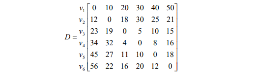
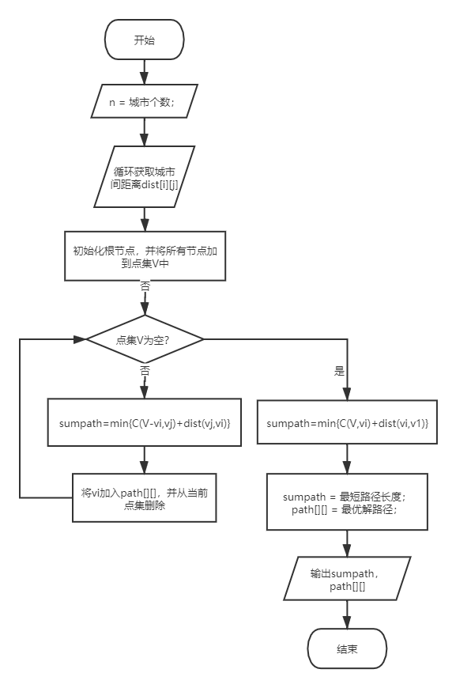

# <div align = "center">算法设计Assignment_1</div>

## <div align = "center">ZY2006109_姬轶</div>

#### 一、用动态规划方法手工求解下面的问题：
某工厂调查了解市场情况，估计在今后四个月内，市场对其产品的需求量如下表所示。
|&nbsp;&nbsp;时期（月）&nbsp;&nbsp;|&nbsp;&nbsp;需要量（产品单位）&nbsp;&nbsp;|
|:--:|:--:|
|1|2|
|2|3|
|3|2|
|4|4|
&nbsp;&nbsp;&nbsp;&nbsp;&nbsp;&nbsp;&nbsp;已知：对每个月来讲，生产一批产品的固定成本费为 3（千元），若不生产，则为零。每生产单位产品的成本费为 1（千元)。同时，在任何一个月内，生产能力所允许的最大生产批量为不超过 6 个单位。

&nbsp;&nbsp;&nbsp;&nbsp;&nbsp;&nbsp;&nbsp;又知每单位产品的库存费用为每月 0.5 （千元），同时要求在第一个月开始之初，及在第四个月末，均无产品库存。

&nbsp;&nbsp;&nbsp;&nbsp;&nbsp;&nbsp;&nbsp;问：在满足上述条件下，该厂应如何安排各个时期的生产与库存，使所花的总成本费用最低？

&nbsp;&nbsp;&nbsp;&nbsp;&nbsp;&nbsp;&nbsp;要求：写出各种变量、状态转移方程、递推关系式、和详细计算步骤。

> 解：
> $\quad$每个月的需求量：$n_k$。
> $\quad$状态变量：每月初的库存容量：$x_k$，有$x_1=x_5=0，0 \leq x_k \leq n_k+···+n_4$。
> $\quad$决策变量：每月初需要生产的容量：$p_k$，有$max\{0,n_k-x_k\} \leq p_k \leq min\{n_k+···+n_4-x_k,6\}$。
> $\quad$状态转移方程：$x_{k+1}=x_k+p_k-n_k$。
> $\quad$则每月花费（Cost）：
> $$
\begin{aligned}
 c_k = \begin{cases}
     0.5(x_k-n_k) & 若 \ p_k=0 \\
     3+p_k+0.5(x_k+p_k-n_k) & 若\ p_k \neq 0
 \end{cases}
 \end{aligned}
> $$
> $\quad$递推关系式为：
> $$
\begin{aligned}
 F_k(x_k) & = min\{c_k+F_{k+1}(x_{k+1})\} \\
    & = \begin{cases}
     min\{0.5(x_k-n_k)+F_{k+1}(x_{k+1})\} & 若 \ p_k=0 \\
     min\{3+p_k+0.5(x_k+p_k-n_k)+F_{k+1}(x_{k+1})\} & 若\ p_k \neq 0 
 \end{cases} \\
 F_5(x_5)&=0
 \end{aligned}
> $$
> $\quad$本题最优条件即为：$F_1({x_1})$最小。下面进行推导：
> $\quad$1）$k=4$时，$x_4+p_4=4$为最优决策，$x_5=0$，
> ||$x_4$|$p_4$|$x_5$|$c_4$|$F_5(x_5)$|$c_4+F_5(x_5)$|
> |:--:|:--:|:--:|:--:|:--:|:--:|:--:|
> |$F_4(0)$|0|4|0|7|0|7|
> |$F_4(1)$|1|3|0|6|0|6|
> |$F_4(2)$|2|2|0|5|0|5|
> |$F_4(3)$|3|1|0|4|0|4|
> |$F_4(4)$|4|0|0|0|0|0|
> 
> </br>$\quad$2）$k=3$时，$max\{0,2-x_3\} \leq p_3 \leq min\{6-x_3,6\}$，
> $\quad$$\quad$a) $x_3=0$时：
> ||$x_3$|$p_3$|$x_4$|$c_3$|$F_4(x_4)$|$c_3+F_4(x_4)$|
> |:--:|:--:|:--:|:--:|:--:|:--:|:--:|
> |$F_3(0)$|0|2|0|5|7|12|
> |$F_3(0)$|0|3|1|6.5|6|12.5|
> |$F_3(0)$|0|4|2|8|5|13|
> |$F_3(0)$|0|5|3|9.5|4|13.5|
> |$F_3(0)$|0|6|4|11|0|11|
> $\quad$此时可以得到$F_3(0)=11$。
> $\quad$$\quad$b) $x_3=1$时：
> ||$x_3$|$p_3$|$x_4$|$c_3$|$F_4(x_4)$|$c_3+F_4(x_4)$|
> |:--:|:--:|:--:|:--:|:--:|:--:|:--:|
> |$F_3(1)$|1|1|0|4|7|11|
> |$F_3(1)$|1|2|1|5.5|6|11.5|
> |$F_3(1)$|1|3|2|7|5|12|
> |$F_3(1)$|1|4|3|9.5|4|13.5|
> |$F_3(1)$|1|5|4|10|0|10|
> $\quad$此时可以得到$F_3(1)=10$。
> $\quad$$\quad$c) $x_3=2$时：
> ||$x_3$|$p_3$|$x_4$|$c_3$|$F_4(x_4)$|$c_3+F_4(x_4)$|
> |:--:|:--:|:--:|:--:|:--:|:--:|:--:|
> |$F_3(2)$|2|0|0|0|7|7|
> |$F_3(2)$|2|1|1|4.5|6|10.5|
> |$F_3(2)$|2|2|2|6|5|11|
> |$F_3(2)$|2|3|3|7.5|4|11.5|
> |$F_3(2)$|2|4|4|9|0|9|
> $\quad$此时可以得到$F_3(2)=7$。
> $\quad$$\quad$d) $x_3=3$时：
> ||$x_3$|$p_3$|$x_4$|$c_3$|$F_4(x_4)$|$c_3+F_4(x_4)$|
> |:--:|:--:|:--:|:--:|:--:|:--:|:--:|
> |$F_3(3)$|3|0|1|0.5|6|6.5|
> |$F_3(3)$|3|1|2|5|5|10|
> |$F_3(3)$|3|2|3|6.5|4|10.5|
> |$F_3(3)$|3|3|4|8|0|8|
> $\quad$此时可以得到$F_3(3)=6.5$。
> $\quad$$\quad$e) $x_3=4$时：
> ||$x_3$|$p_3$|$x_4$|$c_3$|$F_4(x_4)$|$c_3+F_4(x_4)$|
> |:--:|:--:|:--:|:--:|:--:|:--:|:--:|
> |$F_3(4)$|4|0|2|1|5|6|
> |$F_3(4)$|4|1|3|5.5|4|9.5|
> |$F_3(4)$|4|2|4|7|0|7|
> $\quad$此时可以得到$F_3(4)=6$。
> $\quad$$\quad$f) $x_3=5$时：
> ||$x_3$|$p_3$|$x_4$|$c_3$|$F_4(x_4)$|$c_3+F_4(x_4)$|
> |:--:|:--:|:--:|:--:|:--:|:--:|:--:|
> |$F_3(5)$|5|0|3|1.5|4|5.5|
> |$F_3(5)$|5|1|4|6|0|6|
> $\quad$此时可以得到$F_3(5)=5.5$。
> $\quad$$\quad$f) $x_3=6$时：
> ||$x_3$|$p_3$|$x_4$|$c_3$|$F_4(x_4)$|$c_3+F_4(x_4)$|
> |:--:|:--:|:--:|:--:|:--:|:--:|:--:|
> |$F_3(6)$|6|0|4|2|0|2|
> $\quad$此时可以得到$F_3(6)=2$。
> 
> </br>$\quad$3）$k=2$时，$max\{0,3-x_2\} \leq p_2 \leq min\{9-x_2,6\}$，
> $\quad$$\quad$a) $x_2=0$时：
> ||$x_2$|$p_2$|$x_3$|$c_2$|$F_3(x_3)$|$c_2+F_3(x_3)$|
> |:--:|:--:|:--:|:--:|:--:|:--:|:--:|
> |$F_2(0)$|0|3|0|6|11|17|
> |$F_2(0)$|0|4|1|7.5|10|17.5|
> |$F_2(0)$|0|5|2|9|7|16|
> |$F_2(0)$|0|6|3|10.5|6.5|17.5|
> $\quad$此时可以得到$F_2(0)=16$。
> $\quad$$\quad$b) $x_2=1$时：
> ||$x_2$|$p_2$|$x_3$|$c_2$|$F_3(x_3)$|$c_2+F_3(x_3)$|
> |:--:|:--:|:--:|:--:|:--:|:--:|:--:|
> |$F_2(1)$|1|2|0|5|11|16|
> |$F_2(1)$|1|3|1|6.5|10|16.5|
> |$F_2(1)$|1|4|2|8|7|15|
> |$F_2(1)$|1|5|3|9.5|6.5|16|
> |$F_2(1)$|1|6|4|11|6|17|
> $\quad$此时可以得到$F_2(1)=15$。
> $\quad$$\quad$c) $x_2=2$时：
> ||$x_2$|$p_2$|$x_3$|$c_2$|$F_3(x_3)$|$c_2+F_3(x_3)$|
> |:--:|:--:|:--:|:--:|:--:|:--:|:--:|
> |$F_2(2)$|2|1|0|4|11|15|
> |$F_2(2)$|2|2|1|5.5|10|15.5|
> |$F_2(2)$|2|3|2|7|7|14|
> |$F_2(2)$|2|4|3|8.5|6.5|15|
> |$F_2(2)$|2|5|4|10|6|16|
> |$F_2(2)$|2|6|5|11.5|5.5|17|
> $\quad$此时可以得到$F_2(2)=14$。
> $\quad$$\quad$d) $x_2=3$时：
> ||$x_2$|$p_2$|$x_3$|$c_2$|$F_3(x_3)$|$c_2+F_3(x_3)$|
> |:--:|:--:|:--:|:--:|:--:|:--:|:--:|
> |$F_2(3)$|3|0|0|0|11|11|
> |$F_2(3)$|3|1|1|4.5|10|14.5|
> |$F_2(3)$|3|2|2|6|7|13|
> |$F_2(3)$|3|3|3|7.5|6.5|14|
> |$F_2(3)$|3|4|4|9|6|15|
> |$F_2(3)$|3|5|5|10.5|5.5|16|
> |$F_2(3)$|3|6|6|12|2|14|
> $\quad$此时可以得到$F_2(3)=11$。
> $\quad$$\quad$e) $x_2=4$时：
> ||$x_2$|$p_2$|$x_3$|$c_2$|$F_3(x_3)$|$c_2+F_3(x_3)$|
> |:--:|:--:|:--:|:--:|:--:|:--:|:--:|
> |$F_2(4)$|4|0|1|0.5|10|10.5|
> |$F_2(4)$|4|1|2|5|7|13|
> |$F_2(4)$|4|2|3|6.5|6.5|13|
> |$F_2(4)$|4|3|4|8|6|14|
> |$F_2(4)$|4|4|5|9.5|5.5|15|
> |$F_2(4)$|4|5|6|11|2|13|
> $\quad$此时可以得到$F_2(4)=10.5$。
> $\quad$$\quad$f) $x_2=5$时：
> ||$x_2$|$p_2$|$x_3$|$c_2$|$F_3(x_3)$|$c_2+F_3(x_3)$|
> |:--:|:--:|:--:|:--:|:--:|:--:|:--:|
> |$F_2(5)$|5|0|2|1|7|8|
> |$F_2(5)$|5|1|3|5.5|6.5|12|
> |$F_2(5)$|5|2|4|7|6|13|
> |$F_2(5)$|5|3|5|8.5|5.5|14|
> |$F_2(5)$|5|4|6|10|2|12|
> $\quad$此时可以得到$F_2(5)=8$。
> $\quad$$\quad$f) $x_2=6$时：
> ||$x_2$|$p_2$|$x_3$|$c_2$|$F_3(x_3)$|$c_2+F_3(x_3)$|
> |:--:|:--:|:--:|:--:|:--:|:--:|:--:|
> |$F_2(6)$|6|0|3|1.5|6.5|8|
> |$F_2(6)$|6|1|4|6|6|12|
> |$F_2(6)$|6|2|5|7.5|5.5|13|
> |$F_2(6)$|6|3|6|9|2|1|
> $\quad$此时可以得到$F_2(6)=8$。
> $\quad$$\quad$g) $x_2=7$时：
> ||$x_2$|$p_2$|$x_3$|$c_2$|$F_3(x_3)$|$c_2+F_3(x_3)$|
> |:--:|:--:|:--:|:--:|:--:|:--:|:--:|
> |$F_2(7)$|7|4|2|1.5|6|8|
> |$F_2(7)$|7|5|6.5|6|5.5|12|
> |$F_2(7)$|7|6|8|7.5|2|10|
> $\quad$此时可以得到$F_2(7)=8$。
> $\quad$$\quad$h) $x_2=8$时：
> ||$x_2$|$p_2$|$x_3$|$c_2$|$F_3(x_3)$|$c_2+F_3(x_3)$|
> |:--:|:--:|:--:|:--:|:--:|:--:|:--:|
> |$F_2(8)$|8|5|3|2.5|5.5|8|
> |$F_2(8)$|8|6|4|7|2|9|
> $\quad$此时可以得到$F_2(8)=8$。
> $\quad$$\quad$i) $x_2=9$时：
> ||$x_2$|$p_2$|$x_3$|$c_2$|$F_3(x_3)$|$c_2+F_3(x_3)$|
> |:--:|:--:|:--:|:--:|:--:|:--:|:--:|
> |$F_2(9)$|9|0|6|3|2|5|
> $\quad$此时可以得到$F_2(9)=5$。
> 
> </br>$\quad$3）$k=1$时，$x_1=0$，$max\{0,2\} \leq p_2 \leq min\{6,11\}$，
> ||$x_1$|$p_1$|$x_2$|$c_1$|$F_2(x_2)$|$c_1+F_2(x_2)$|
> |:--:|:--:|:--:|:--:|:--:|:--:|:--:|
> |$F_1(0)$|0|2|0|5|16|21|
> |$F_1(0)$|0|3|1|6.5|15|21.5|
> |$F_1(0)$|0|4|2|8|7|22|
> |$F_1(0)$|0|5|3|9.5|11|20.5|
> |$F_1(0)$|0|6|4|11|10.5|21.5|
> $\quad$此时可以得到$F_1(0)=20.5$。
> 
> </br>$\quad$通过以上步骤可以得出，最优总成本为$F_1(0)=20.5$（千元）。
> $\quad$每月产能安排如下所示：
> 
> |月份$k$|月初库存量$x_k$|月需求量$n_k$|月产量$p_k$|月成本$c_k$|
> |:--:|:--:|:--:|:--:|:--:|
> |1|0|2|5|9.5|
> |2|3|3|0|0|
> |3|0|2|6|11|
> |4|4|4|0|0|
> |5|0|---|---|---|
</br>

#### 二、用动态规划方法编程求解下面的问题：
&nbsp;&nbsp;&nbsp;&nbsp;&nbsp;&nbsp;&nbsp;某推销员要从城市 $v_1$ 出发，访问其它城市 $v_2，v_3，…，v_6$ 各一次且仅一次，最后返回 $v_1$。D为各城市间的距离矩阵。

&nbsp;&nbsp;&nbsp;&nbsp;&nbsp;&nbsp;&nbsp;问：该推销员应如何选择路线，才能使总的行程最短？

<div align=center></div>

&nbsp;&nbsp;&nbsp;&nbsp;&nbsp;&nbsp;&nbsp;要求：写出递推关系式、伪代码和程序相关说明，并分析时间复杂性。

> 解：
> $\quad$设$v_1,v_a,...,v_e,v_1$为满足题意的最短路径，假设$v_e,v_1$已经确定时，问题暂时转化为求$v_1$到$v_e$的最短路径问题。
> $\quad$我们定义$C(V,v_i)$，表示从点$v_1$出发，访问过$V\subseteq\{v_2,v_3,...,v_n\}$最后停留在$v_i$时的最短路径长度。
> $\quad$当$V$中没有城市时，有$C(v_1,v_1)=0$。
> $\quad$当$V$中仅有一个城市$v_2$时，有$C(v_1,v_i)=d(v_1,v_2)$。
> $\quad$状态转移方程也就为（$v_j \in V$）：
> $$
> C(V,v_i)=min\{C(V-\{v_i\},v_j)+d(v_j,v_i)\}
> $$ $\quad$最优解即为（$V=\{v_2,v_3,...,v_n\}$）：
> $$
> min\{C(V,v_i)+d(v_i,v_1)\}
> $$ $\quad$伪代码如下所示：
> ```scala
> 输入：城市数n和相应的距离矩阵
> 输出：最短距离和相应的路径
> function TSP(v, reach):
>     if dp[v][reach] != -1 then
>          return dp[v][reach]
>     endif
>     if v == (1 << n) THEN
>         return dist[0][reach]
>     endif
>     # 初始最长路径设置为999999999
>     sumpath <- 999999999
>     for var i to n by 1 do
>         # 取出整数v在二进制表示下的第i位，表示经过城市V中的vi
>         if v & (1 << i) then
>             m <- TSP(v & (~(1 << i)), i) + dist[i][reach]
>             # 更新最短路径长度，保存路径
>             if m < sumpath then
>                 sumpath <- m
>                 path[v][reach] <- i
>             endif
>         endif
>     endfor
>     dp[v][reach] <- sumpath
>     return dp[v][reach]
> endfunction
> 
> if __name__ == "__main__" then
>     if n == 1 then
>         print('最短距离为：0')
>         print('最短路径为：1->', end='')
>     else:
>         # 起点为v1
>         reach_point <- 0
>         # 二进制表示经过城市，初始状态全为1，表示所有城市都经过
>         s <- 2**(n + 1) - 2
>         do TSP(s, reach_point)
>         reach <- 0
>         print('最短距离为：' + str(distance))
>         print('最短路径为：1->', end='')
>         for var num to n-1 by 1 do
>             reach <- int(path[s][reach])
>             print(str(reach + 1) + '->', end='')
>             # 在路径中去掉该已达城市
>             s <- s & (~(1 << reach))
>         endfor
>     endif
> ```
> $\quad$算法流程图：<div align=center></div>
> > $\quad$具体设计采用动态压缩的思想，使用二进制位运算代替多维数组存储各路径状态，0代表未经过的城市，1代表已经经过的城市，通过位运算可以获得下一个城市节点，例如$v\& (1<<i)$可以表示取出$V$中已存在的城市$v_i$。
> $\quad$分析复杂度：对于n个城市，我们有$O(2^n·n)$种状态，对于每种状态，状态转移的复杂度为$O(n)$，故算法的整体时间复杂度为$O(2^n·n^2)$。